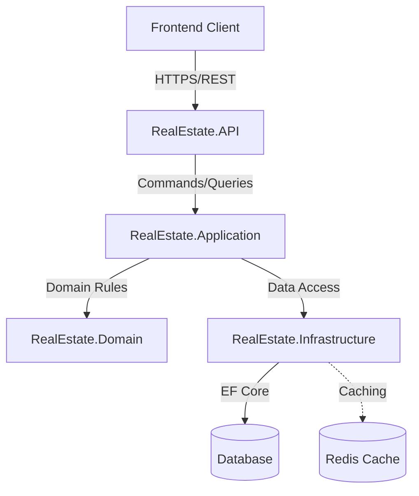
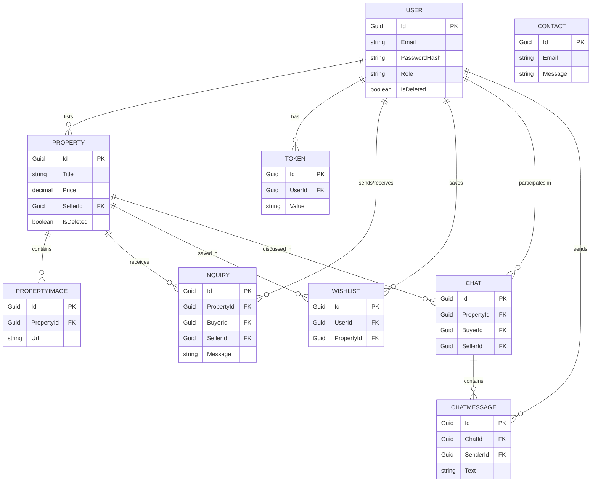

# Real Estate Management System - Technical PRD & Documentation

## 1. Product Overview
**Purpose:**
The Real Estate Management System is a comprehensive platform designed to facilitate the buying, selling, and renting of properties. It connects property sellers/owners with potential buyers/tenants, streamlining the entire property lifecycle from listing to final transaction.

**Users:**
- **Admin:** Manages users, verifies property listings, and oversees platform operations.
- **Seller/Agent:** Lists properties, manages listings, and responds to buyer inquiries.
- **Buyer/Tenant:** Searches for properties, contacts sellers, and schedules appointments.

**Main Features:**
- User authentication and role-based access control.
- Property listing creation, editing, and management.
- Advanced search and filtering for properties.
- Inquiry and contact management between buyers and sellers.
- Appointment scheduling.

**Workflows:**
- **User Management:** Registration, login, role assignment.
- **Property Lifecycle:** Creation -> Admin Verification -> Publishing -> Inquiries -> Sold/Rented.

---

## 2. Technology Stack
**Frontend:**
- **Framework:** React, Angular, or modern component-based framework.
- **Styling:** CSS3, Tailwind CSS, or Material-UI for responsive design.
- **Why:** To provide a dynamic, single-page application (SPA) experience with fast rendering and modular components.

**Backend:**
- **Framework:** .NET (C#) using ASP.NET Core Web API.
- **Architecture:** Clean Architecture with CQRS (Command Query Responsibility Segregation).
- **Libraries/Tools:** MediatR (for CQRS dispatching), Entity Framework Core (ORM), AutoMapper/Mapster (for object mapping), FluentValidation.
- **Why:** .NET provides high performance, strong typing, and enterprise-level scalability. CQRS separates read and write operations, improving maintainability and performance.

**Database:**
- **RDBMS:** Microsoft SQL Server (or PostgreSQL).
- **Why:** Relational databases are ideal for structured data like properties, users, and transactions, ensuring ACID compliance.

---

## 3. Backend Architecture
The backend follows **Clean Architecture**, separating concerns into distinct layers:

1. **API Layer (`RealEstate.API`):** The entry point of the application. Contains Controllers, Middlewares, and Dependency Injection setup. It depends only on the Application layer.
2. **Application Layer (`RealEstate.Application`):** Contains business logic, MediatR Handlers, Commands, Queries, DTOs, and Interfaces.
3. **Domain Layer (`RealEstate.Domain`):** The core of the system. Contains Entities, Value Objects, and Domain Exceptions. Has no dependencies on other layers.
4. **Infrastructure Layer (`RealEstate.Infrastructure`):** Implements interfaces defined in the Application layer. Contains DbContext, Repositories, external service integrations (e.g., Email service), and authentication configurations.

**Key Concepts:**
- **CQRS & MediatR:** Commands (writes) and Queries (reads) are separated. The API controllers send requests via MediatR, which dispatches them to the appropriate Handler in the Application layer.
- **DTOs (Data Transfer Objects):** Used to pass data between the API and Application layers without exposing internal Domain Entities.
- **Dependency Injection (DI):** Injected via the built-in ASP.NET Core DI container to ensure loose coupling.

---

## 4. Database Design
### Major Tables
- **`User`:** Stores user credentials and profile details.
  - *Fields:* `Id` (PK, Guid), `Name`, `Email`, `PasswordHash`, `Role`, `Phone`, `IsBlocked`, `ProfilePic`, `Address`, `IsApproved`, `IsVerified`, `CreatedAt`, `IsDeleted`.
- **`Token`:** Manages user tokens for authentication, password resets, etc.
  - *Fields:* `Id` (PK, Guid), `UserId` (FK to User), `Value`, `CreatedAt`, `ExpiresAt`.
- **`Property`:** Stores property details listed by sellers.
  - *Fields:* `Id` (PK, Guid), `Title`, `Description`, `Price`, `Address`, `PropertyType`, `Bhk`, `Bathrooms`, `AreaSize`, `Furnishing`, `Status`, `IsVerified`, `Views`, `SellerId` (FK to User), `CreatedAt`, `IsDeleted`.
- **`PropertyImage`:** Stores images related to a property.
  - *Fields:* `Id` (PK, Guid), `PropertyId` (FK to Property), `Url`, `SortOrder`.
- **`Inquiry`:** Stores messages/inquiries from buyers to sellers for a specific property.
  - *Fields:* `Id` (PK, Guid), `PropertyId` (FK to Property), `BuyerId` (FK to User), `SellerId` (FK to User), `Message`, `IsRead`.
- **`Wishlist`:** Tracks properties that users have saved to their wishlist.
  - *Fields:* `Id` (PK, Guid), `UserId` (FK to User), `PropertyId` (FK to Property).
- **`Contact`:** Stores generic contact messages (e.g., from a "Contact Us" page).
  - *Fields:* `Id` (PK, Guid), `Name`, `Email`, `Phone`, `Role`, `Message`.
- **`Chat`:** Represents a chat session between a buyer and a seller.
  - *Fields:* `Id` (PK, Guid), `PropertyId` (FK to Property, optional), `BuyerId` (FK to User), `SellerId` (FK to User).
- **`ChatMessage`:** Stores individual messages within a chat.
  - *Fields:* `Id` (PK, Guid), `ChatId` (FK to Chat), `SenderId` (FK to User), `Text`, `Image`, `CreatedAt`.

### Relationships
- **1-to-Many (`User` to `Property`):** One seller can list multiple properties.
- **1-to-Many (`User` to `Token`):** One user can have multiple active tokens.
- **1-to-Many (`Property` to `PropertyImage`):** One property has multiple images.
- **1-to-Many (`Property` to `Inquiry`):** One property receives multiple inquiries.
- **1-to-Many (`User` to `Inquiry`):** One buyer can make multiple inquiries, and one seller receives them.
- **1-to-Many (`User` to `Wishlist` & `Property` to `Wishlist`):** A user has a wishlist of many properties; a property can be in many wishlists (Many-to-Many resolution).
- **1-to-Many (`User` to `Chat` & `Property` to `Chat`):** Chats involve two users (Buyer/Seller) and optionally reference a property.
- **1-to-Many (`Chat` to `ChatMessage` & `User` to `ChatMessage`):** A chat has multiple messages sent by users.

---

## 5. Design Patterns
- **CQRS (Command Query Responsibility Segregation):** Separates read models from write models. 
  - *Why:* Optimizes performance, scalability, and security by treating reads and writes differently.
- **Mediator Pattern (via MediatR):** Reduces chaotic dependencies between objects. 
  - *Why:* Controllers simply send messages (Commands/Queries), and MediatR routes them to the correct handler, keeping controllers thin.
- **Repository Pattern (Often used with EF Core):** Abstracts data access logic.
  - *Why:* Makes the application data-store agnostic and simplifies unit testing.
- **Dependency Injection:** Inverts the control of object creation.
  - *Why:* Promotes loose coupling, making the system easier to test and maintain.

---

## 6. Complete Workflow (Request Flow)
1. **Frontend:** User submits a form (e.g., "Add Property"). The frontend makes an HTTP POST request to the API.
2. **API (Controller):** Receives the HTTP request, validates the basic payload, and maps it to a Command (e.g., `AddPropertyCommand`).
3. **Dispatcher (MediatR):** The controller calls `_mediator.Send(command)`.
4. **Handler (`AddPropertyCommandHandler`):** MediatR routes the command to its specific handler in the Application layer.
5. **Business Logic & Database (Infrastructure):** The handler applies business rules, creates a `Property` entity, and uses the `DbContext` (or Repository) to save it to the database.
6. **Response:** The handler returns a result (e.g., property ID or a success DTO). The controller returns an HTTP 200/201 response back to the Frontend.

---

## 7. Authentication
- **JWT (JSON Web Tokens):** Used for stateless authentication.
- **Workflow:** 
  1. User logs in with email/password.
  2. API validates credentials against the database.
  3. API generates a JWT containing the user's `Id` and `Role` (e.g., Admin, Seller, Buyer).
  4. Frontend stores the token (e.g., in localStorage or HttpOnly cookie) and attaches it as a Bearer token in the `Authorization` header for subsequent requests.
- **Authorization:** API endpoints are protected using `[Authorize(Roles = "...")]` attributes to ensure only users with appropriate roles can access specific features.

---

## 8. Property Workflow
1. **Creation:** Seller creates a property draft with details and images. Status = `PendingVerification`.
2. **Verification:** Admin reviews the property details.
3. **Approval/Publishing:** Admin approves the listing. Status = `Published`/`Active`. The property is now visible to buyers.
4. **Inquiry:** A buyer views the property and submits a contact form.
5. **Appointment:** Seller and buyer arrange a viewing (via system messages or external contact).
6. **Sold/Rented:** Once the transaction is complete, the seller marks the property as `Sold` or `Rented`. Status = `Closed`.

---

## 9. Soft Delete
- **Fields:** Entities include `IsActive` (boolean) and `IsDeleted` (boolean) properties.
- **Concept:** When a record (e.g., a Property or User) is deleted, it is not removed from the database via a `DELETE` SQL statement. Instead, `IsDeleted` is set to `true`.
- **Why:** Preserves historical data, prevents breaking foreign key constraints (e.g., a user has old inquiries), and allows for easy data recovery.
- **Implementation:** EF Core Global Query Filters are used to automatically exclude records where `IsDeleted == true` from standard queries.
- **Audit Fields:** Entities also contain `CreatedAt`, `CreatedBy`, `UpdatedAt`, and `UpdatedBy` to track data changes over time.

---

## 10. Scalability
As the system grows, the architecture supports scaling through:
- **Pagination:** Implementing offset/limit or cursor-based pagination for property listings to reduce database load and improve API response times.
- **Indexing:** Adding SQL indexes on frequently queried columns (e.g., `Price`, `Location`, `Status`) to speed up search operations.
- **Caching (Redis):** Caching frequently accessed, infrequently changing data (e.g., lists of cities, featured properties) to reduce database hits.
- **Background Jobs (e.g., Hangfire):** Offloading heavy tasks (like sending bulk emails or processing images) to background workers.
- **Load Balancing:** Deploying the stateless API across multiple servers/containers and routing traffic via a load balancer.

---

## 11. Security and Performance
- **Security:**
  - **Input Validation:** Using FluentValidation to sanitize and validate all incoming DTOs.
  - **SQL Injection Protection:** Entity Framework Core automatically uses parameterized queries.
  - **CORS:** Configured to only allow requests from trusted frontend domains.
  - **Rate Limiting:** Implemented to prevent brute-force attacks and abuse of the API.
- **Performance:**
  - **Asynchronous Programming:** Using `async/await` throughout the stack to free up threads during I/O operations (database calls, network requests).
  - **No-Tracking Queries:** Using `.AsNoTracking()` in EF Core for read-only queries to reduce memory overhead.

---

## 12. Architecture Diagrams

### High-Level System Architecture

### Database Entity Relationship (ER) Diagram

