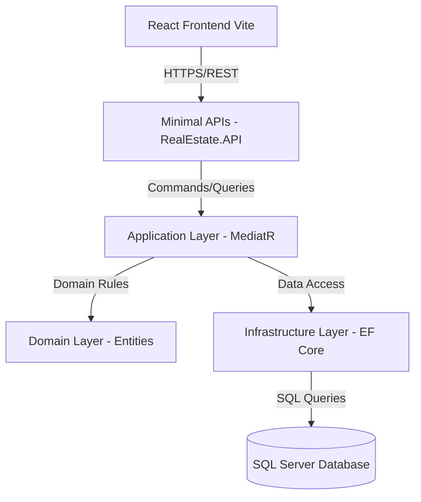
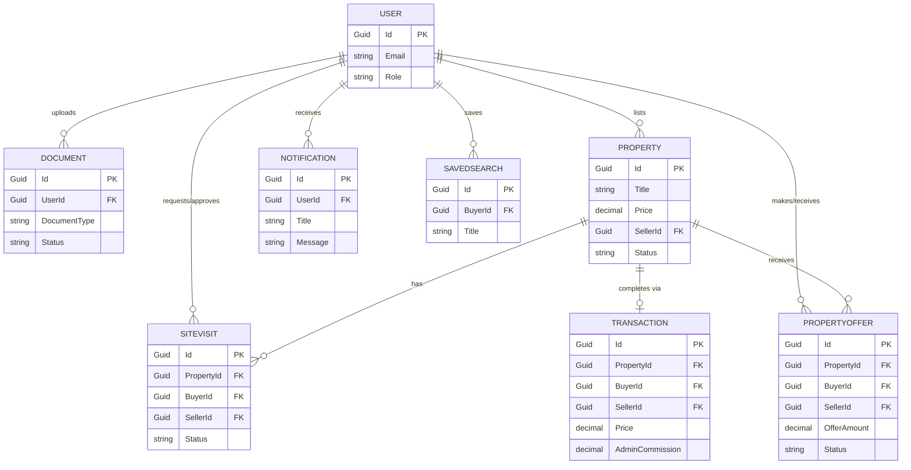

# Real Estate Management System - Technical PRD & Documentation

## 1. Product Overview
**Purpose:**
The Real Estate Management System is a comprehensive platform designed to facilitate the buying, selling, and renting of properties. It connects property sellers/owners with potential buyers/tenants, streamlining the entire property lifecycle from listing, visits, offers, to final transactions.

**Users:**
- **Admin:** Manages users, verifies seller documents, approves property listings, oversees platform operations, and manages system settings.
- **Seller/Agent:** Uploads verification documents, lists properties, manages listings, responds to buyer inquiries, approves/rejects site visits, and accepts/rejects property offers.
- **Buyer/Tenant:** Searches for properties, saves searches, manages wishlists, makes inquiries, schedules site visits, makes property offers, and tracks transactions.

**Main Features:**
- User authentication and role-based access control.
- Seller verification via document uploads.
- Property listing creation, editing, and management.
- Advanced property search with save functionality.
- Inquiry, real-time chat, and contact management between buyers and sellers.
- Site visit scheduling and management.
- Property offers and transaction tracking (including commission calculations).
- In-app notification system.

---

## 2. Technology Stack
**Frontend:**
- **Framework:** React with Vite.
- **Styling:** CSS3 (Tailwind CSS/custom CSS).
- **Why:** To provide a dynamic, single-page application (SPA) experience with fast rendering and modular components.

**Backend:**
- **Framework:** .NET (C#) using ASP.NET Core Web API.
- **Architecture:** Clean Architecture with CQRS (Command Query Responsibility Segregation).
- **Libraries/Tools:** MediatR (for CQRS dispatching), Entity Framework Core (ORM), FluentValidation.
- **Why:** .NET provides high performance, strong typing, and enterprise-level scalability. CQRS separates read and write operations, improving maintainability and performance.

**Database:**
- **RDBMS:** Microsoft SQL Server.
- **Why:** Relational databases are ideal for structured data like properties, users, and transactions, ensuring ACID compliance.

---

## 3. Backend Architecture
The backend follows **Clean Architecture**, separating concerns into distinct layers:

1. **API Layer (`RealEstate.API`):** The entry point of the application. Contains specific Endpoint classes (e.g., `PropertyEndpoints`, `UserEndpoints`, `AdminEndpoints`) using Minimal APIs, and Dependency Injection setup. It depends only on the Application layer.
2. **Application Layer (`RealEstate.Application`):** Contains business logic organized by feature modules (`Admin`, `Auth`, `Buyer`, `Chats`, `Contacts`, `Documents`, `Inquiries`, `Notifications`, `Property`, `PropertyOffers`, `SavedSearches`, `SiteVisits`, `Users`, `Wishlist`). It holds MediatR Handlers, Commands, Queries, and DTOs.
3. **Domain Layer (`RealEstate.Domain`):** The core of the system. Contains Entities (inheriting from `BaseAuditableEntity`), Enums, and Domain Exceptions. Has no dependencies on other layers.
4. **Infrastructure Layer (`RealEstate.Infrastructure`):** Implements interfaces defined in the Application layer. Contains DbContext, Repositories, external service integrations, and authentication configurations.

**Key Concepts:**
- **CQRS & MediatR:** Commands (writes) and Queries (reads) are separated. The API endpoints send requests via MediatR, which routes them to the appropriate Handler in the Application layer.
- **Base Auditable Entity:** Common entity tracking `CreatedAt`, `UpdatedAt`, `CreatedBy`, and `UpdatedBy`.

---

## 4. Database Design
### Major Tables
- **`User`:** Stores user credentials and profile details.
- **`Token`:** Manages user tokens for authentication, password resets, etc.
- **`Document`:** Stores seller verification documents (e.g., Aadhaar, PAN). Fields include `DocumentType`, `FileUrl`, `Status` (Uploaded, Verified, Rejected).
- **`Property`:** Stores property details (Title, Price, Type, Bhk, AreaSize, Status).
- **`PropertyImage`:** Stores images related to a property.
- **`Inquiry`:** Stores messages/inquiries from buyers to sellers for a specific property.
- **`Wishlist`:** Tracks properties that users have saved.
- **`SavedSearch`:** Stores search criteria (MinPrice, MaxPrice, City, Bhk) for buyers to receive email alerts.
- **`SiteVisit`:** Manages physical visit appointments requested by buyers. Statuses include `Pending`, `Approved`, `Rejected`, `Completed`.
- **`PropertyOffer`:** Stores monetary offers from buyers to sellers. Fields include `OfferAmount` and `Status` (`Pending`, `Accepted`, `Rejected`).
- **`Transaction`:** Records final financial transactions. Tracks `Price`, `AdminCommission`, `SellerRevenue`, and `Status`.
- **`Review`:** Stores user ratings and comments on properties/sellers.
- **`Notification`:** System notifications for users. Tracks `Title`, `Message`, `Type`, and `IsRead`.
- **`Chat` & `ChatMessage`:** Facilitates real-time messaging between buyers and sellers.
- **`Contact`:** Stores generic contact messages (e.g., from a "Contact Us" page).

### Relationships
- **User -> Property (1:N):** A seller lists multiple properties.
- **User -> Document (1:N):** A seller uploads multiple verification documents.
- **Property -> PropertyImage (1:N):** A property has multiple images.
- **Buyer -> SavedSearch (1:N):** A buyer can save multiple search filters.
- **Property -> SiteVisit (1:N):** A property can have multiple site visits scheduled.
- **Property -> PropertyOffer (1:N):** A property can receive multiple monetary offers.
- **Property -> Transaction (1:1):** A property has a final transaction record once sold.
- **User -> Notification (1:N):** A user receives multiple system notifications.
- **Chat -> ChatMessage (1:N):** A chat session contains multiple messages.

---

## 5. Request Flow (API to DB)
1. **Frontend Request:** The React client makes an HTTP request to a specific Minimal API endpoint (e.g., `POST /api/properties`).
2. **Endpoint Routing:** The endpoint maps the incoming request to a specific MediatR Command (e.g., `CreatePropertyCommand`).
3. **Dispatcher (MediatR):** The endpoint calls `_mediator.Send(command)`.
4. **Handler Execution:** The specific Handler (e.g., `CreatePropertyCommandHandler`) executes the business logic, applies rules, creates/updates Domain Entities, and calls the Infrastructure repository/DbContext to save changes.
5. **Response:** The handler returns a result, which the API endpoint maps to an appropriate HTTP response (200 OK, 201 Created, etc.) for the frontend.

---

## 6. Core System Workflows

### A. Seller Verification Workflow
1. Seller registers and uploads identification `Document`s. Status: `Uploaded`.
2. Admin reviews documents in the Admin Dashboard (`SellerRequests`).
3. Admin approves documents. Status changes to `Verified`.
4. A `Notification` is sent to the seller confirming their verified status, allowing them to publish properties.

### B. Property Lifecycle
1. Seller submits a new property listing with details and images. Status: `PendingVerification`.
2. Admin reviews the listing in `AdminProperties` and approves it. Status: `Published`.
3. The property appears in search results for Buyers.

### C. Buyer Interaction Workflow
1. **Search & Save:** Buyer searches for properties and can save their criteria (`SavedSearch`) to get alerts.
2. **Wishlist:** Buyer adds interesting properties to their `Wishlist`.
3. **Inquiry & Chat:** Buyer sends an `Inquiry` or initiates a direct `Chat` with the seller.
4. **Site Visit:** Buyer requests a `SiteVisit`. The seller sees this in `VisitRequests` and can `Approve` or `Reject` it.

### D. Offer and Transaction Workflow
1. **Make Offer:** Buyer submits a `PropertyOffer` with an `OfferAmount`. Status: `Pending`.
2. **Seller Decision:** Seller reviews the offer in `SellerOffers` and can `Accept` or `Reject`.
3. **Transaction:** If an offer is accepted and finalized, a `Transaction` is generated, calculating `SellerRevenue` and `AdminCommission` based on the final `Price`.
4. Property status is updated to `Closed`/`Sold`.

---

## 7. Authentication & Authorization
- **JWT (JSON Web Tokens):** Used for stateless authentication.
- **Workflow:** 
  1. User authenticates via Auth endpoints.
  2. API validates credentials and returns a JWT containing `Id` and `Role` (Admin, Seller, Buyer).
  3. Frontend stores the token and passes it in the `Authorization: Bearer` header.
- **Role-Based Access Control (RBAC):** API endpoints restrict access based on roles. For example, only Admins can access `AdminEndpoints`.

---

## 8. Soft Delete & Auditing
- **Auditing:** All entities inherit `BaseAuditableEntity`, tracking `CreatedAt`, `CreatedBy`, `UpdatedAt`, and `UpdatedBy`.
- **Soft Delete:** Entities use an `IsDeleted` boolean. 
- **Implementation:** EF Core Global Query Filters ensure that records with `IsDeleted == true` are automatically excluded from standard queries, preserving historical data and maintaining referential integrity.

---

## 9. Architecture Diagrams

### High-Level System Architecture

### Database Entity Relationship (ER) Diagram

